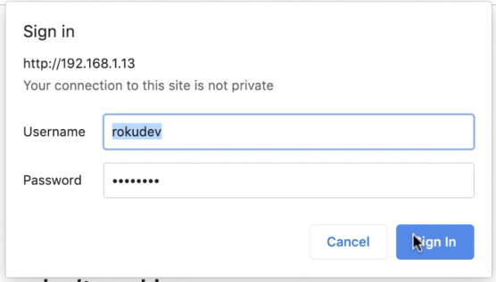

# Creating a Grid Screen

Following along with the [Grid Screen tutorial](https://developer.roku.com/en-gb/videos/courses/rsg/grid-screen.md) from Roku Developers. This is a very barebones Roku app with just a main menu of thumbnails.

To run this application, you have to do [a bit of setup](https://developer.roku.com/en-gb/videos/courses/rsg/development-setup.md). First, put your Roku device in developer mode, by pressing 

> , , , , , , , , , 

This will bring up the developer mode page. You'll have to agree to Roku's terms. Record the URL from the device and allow it to reset. Set a password for the dev tools and remember the username. 

You'll have to have a roku account and request developer privileges. 

Then, if your Roku device and work station are on the same network, you should be able to add the app to your device and see it in action.

---
## Attribution
---
, , ,  from Font Awesome under a [CC BY 4.0 License](https://fontawesome.com/license/free)